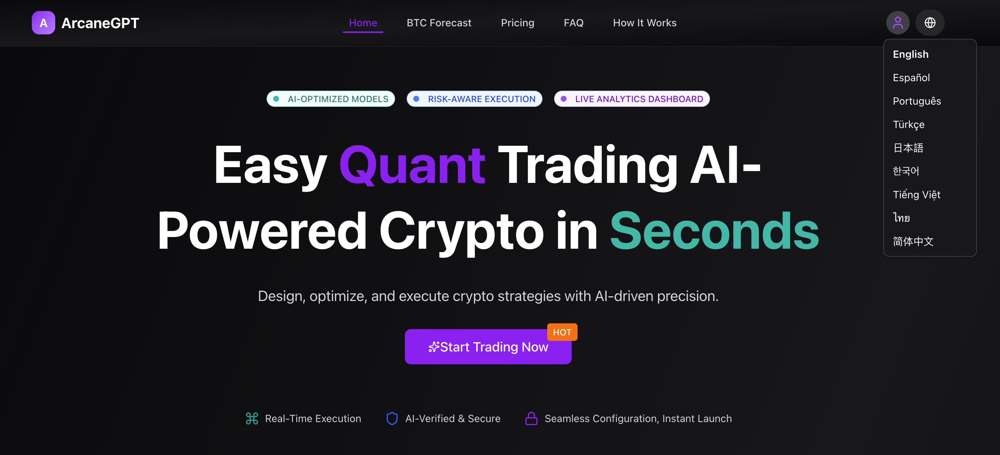
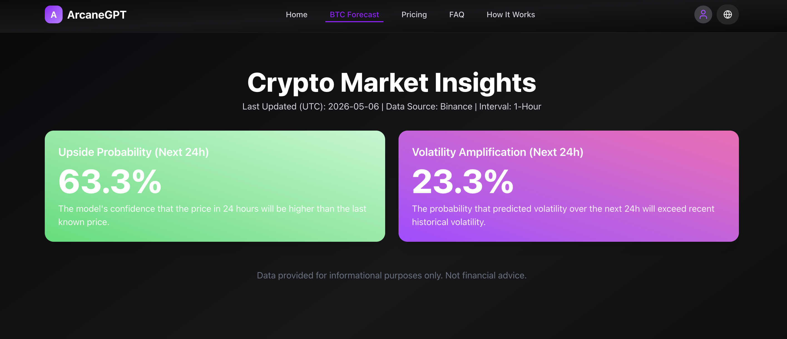
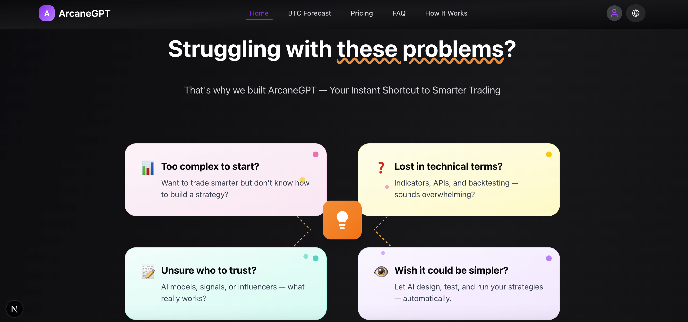
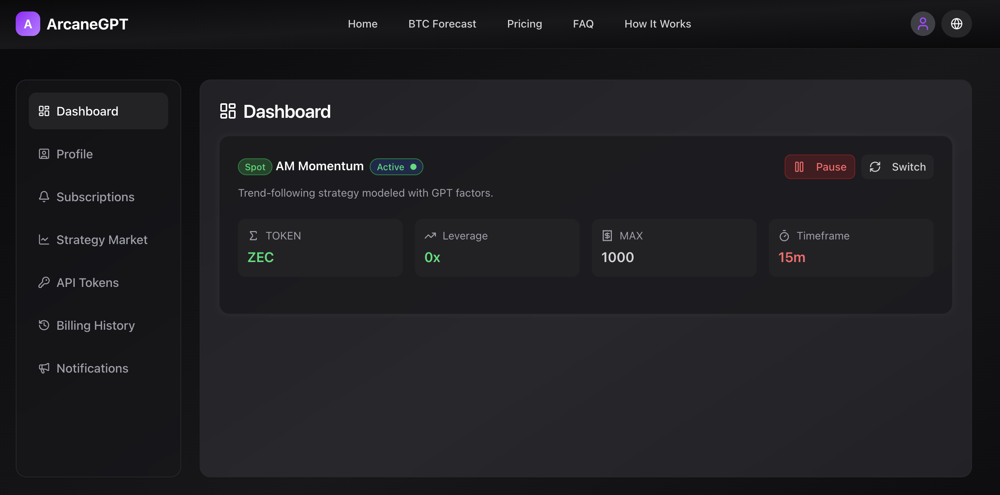
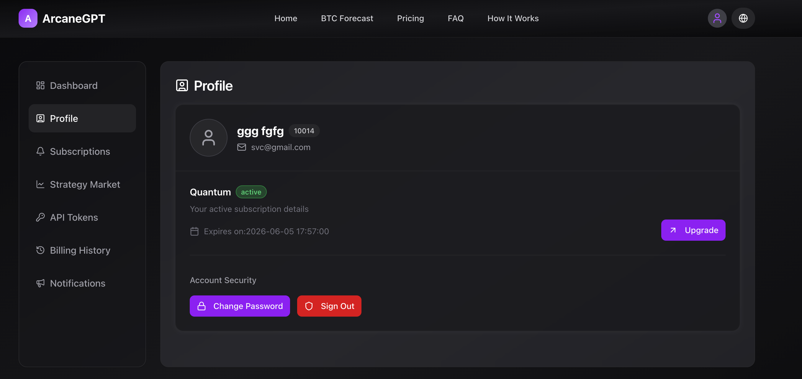
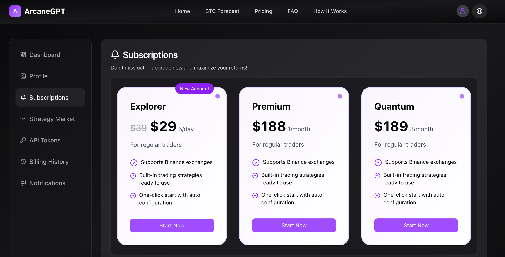
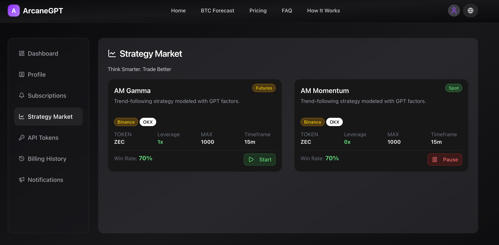
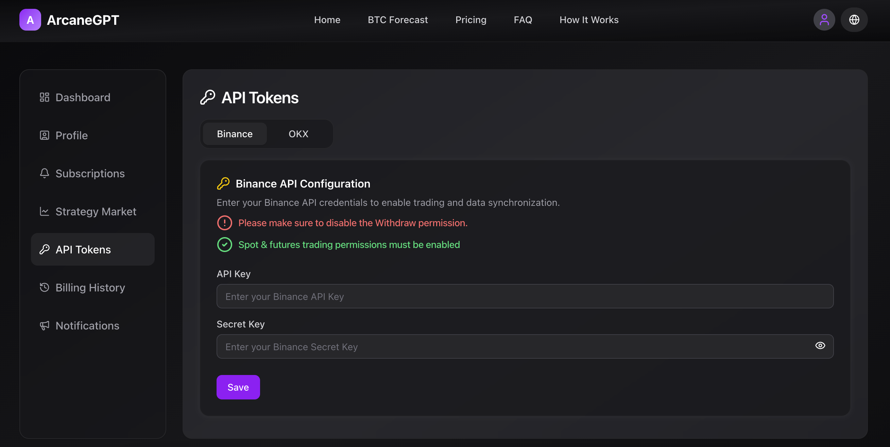
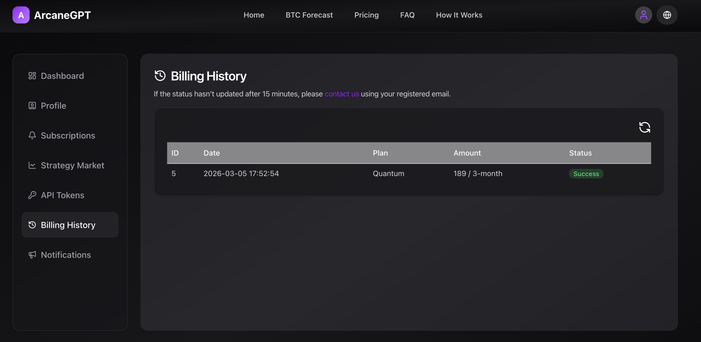
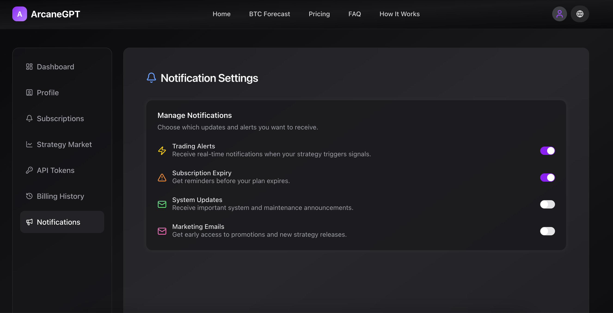

# 🚀 前端AMCC说明（Frontend Tech Stack）
### 如果您需要整套的前后端代码，请留下你的Issues

## 📦 基础框架

* **Next.js 16**

  * 基于 React 的全栈框架（App Router）
  * 支持 SSR / SSG / ISR
  * 优化首屏加载与 SEO

* **React 19**

  * 使用最新特性（并发渲染、Hooks）
  * 组件化开发，提升复用性与可维护性

---

## 🎨 UI & 样式方案

* **Tailwind CSS 4**

  * 原子化 CSS，快速构建 UI
  * 支持响应式设计与暗黑模式

* **tailwindcss-animate**

  * 提供常用动画效果

* **class-variance-authority (CVA)**

  * 管理组件样式变体（variants）

* **clsx / tailwind-merge**

  * 动态 className 合并与冲突处理

---

## 🧩 UI 组件库

* **Radix UI**

  * 无样式、可访问性优先的组件库
  * 使用组件：

    * Dialog
    * Dropdown Menu
    * Tabs
    * Switch
    * Select
    * Avatar
    * Progress 等

* **lucide-react**

  * 轻量级图标库

---

## 📊 数据可视化

* **recharts**

  * React 图表库（基于 SVG）

* **lightweight-charts**

  * 高性能金融图表（适合 K 线 / 交易数据）

---

## 🧠 状态管理

* **Zustand**

  * 轻量级状态管理
  * 无样板代码，简单易用

---

## 🌐 国际化

* **next-intl**

  * Next.js 国际化解决方案
  * 支持多语言路由与翻译

---

## 🔐 认证与权限

* **next-auth (v5 beta)**

  * 支持 OAuth / Credentials 登录
  * 与 Next.js 深度集成

---

## ⏱️ 日期处理

* **dayjs**
* **date-fns**

👉 提供时间格式化、计算等能力

---

## 🧾 其他工具库

* **react-qr-code**

  * 生成二维码

* **react-syntax-highlighter**

  * 代码高亮显示

* **sonner**

  * Toast 通知组件

---

## 🛠️ 开发工具

* **TypeScript 5**

  * 类型安全，提高代码质量

* **ESLint 9**

  * 代码规范检查

* **eslint-config-next**

  * Next.js 官方规则集

---

## ⚙️ 运行

```bash
npm run dev
# or
yarn dev
# or
pnpm dev
# or
bun dev
```

---

## 📁 项目结构（推荐）

```bash
/app        # Next.js App Router
/components # 公共组件
/pages      # 页面（兼容或特殊用途）
```

---

## 🌙 主题模式

* 支持 **Dark Mode（class 模式）**
* 可通过 class 切换主题

---

## ✨ 技术特点总结

* ⚡ 基于 Next.js 的现代化全栈架构
* 🎨 Tailwind + Radix UI 高效构建 UI
* 🧠 Zustand 简洁状态管理
* 🌍 完整国际化支持
* 📊 支持复杂数据可视化（图表/金融数据）
* 🔐 完整认证体系（NextAuth）

---

## 📌 部分截图












---
